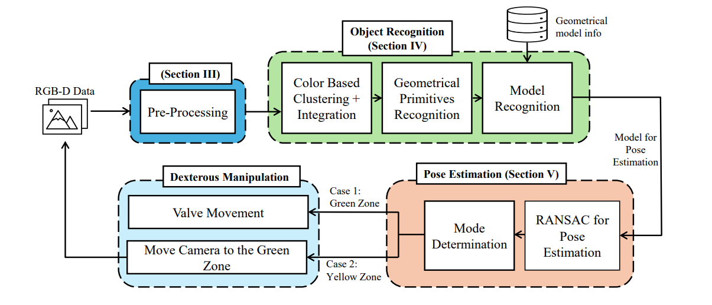
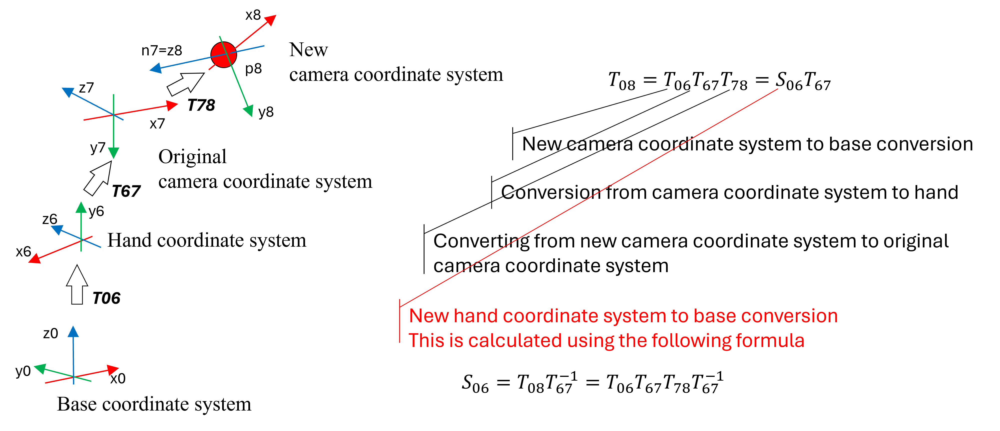

# Dexterous Manipulation System Using Object Recognition and Pose Estimation (Object_Rec_Pose_Est)

## Source Code Structure
This project implements an integrated system for 3D object recognition, 6-DOF pose estimation, and dexterous manipulation using a JACO robotic arm equipped with an Intel RealSense D435 camera. The system is designed to automate industrial tasks such as opening and closing valves by accurately identifying objects, estimating their poses, and manipulating them within a controlled environment.

### Dependencies
- Point Cloud Library (PCL)
- Intel RealSense SDK 2.0
- Kinova robot arm SDK

### Methodology

The methodology of this repository can be summarized in the following Figure.

- Object Recognition: Identifies geometrical primitives like cylinders, planes, and circles using point cloud data.
- Pose Estimation: Determines the position and orientation of objects using RANSAC algorithms.
- Dexterous Manipulation: Executes movements to manipulate valve handles dynamically adjusting the robotic arm's position based on zonal classifications (Green Zone and Yellow Zone) for optimal pose estimation and successful task execution.

  ### ObjectTransformation.cpp
ObjectTransformation class transforms the position and orientation from the object frame to the robot arm frame (world frame) as in the following Figure.

## Dataset Structure

This repository contains a 3D Database for object recognition and pose estimation focusing on ball and globe valves. The research behind this database aims to develop a novel object recognition and pose estimation system designed to assist in valve opening and closing. Data for different pitch and yaw angles are containing this database.

The dataset is organized with **four key files** for each instance in the database:

1. **log.csv**: 
   - A log file that includes detailed information about each instance, including the associated angles, positions, and metadata.

2. **Captured_Frame.pcd**: 
   - The original point cloud frame captured by the system.

3. **RANSAC.pcd**: 
   - The robotic system generates the pose estimation results using the RANSAC algorithm based on the `Captured_Frame.pcd`.

4. **angle.pcd**: 
   - The estimated angle output by the robotic system.

Each instance is categorized by the object type (ball or globe valve) and the angle information.

## Citation

If you use this database in your research, please cite the following paper:

Manawadu, Udaka A., and Naruse Keitaro. 2024. "Dexterous Manipulation Based on Object Recognition and Accurate Pose Estimation Using RGB-D Data." *Sensors* 24, no. 21: 6823. [https://doi.org/10.3390/s24216823](https://doi.org/10.3390/s24216823).
